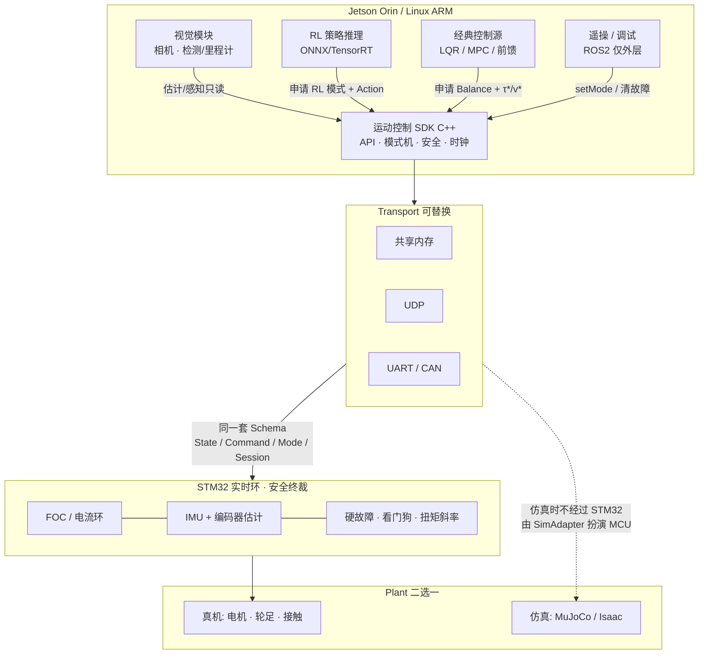
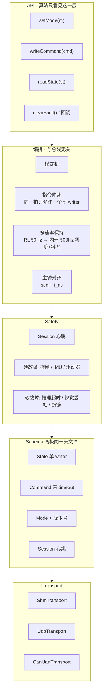
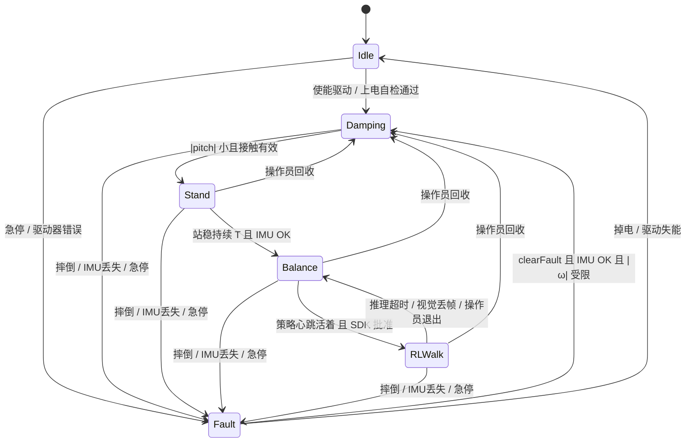
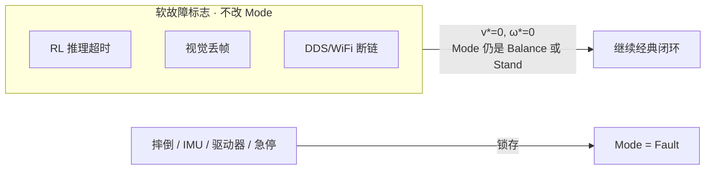
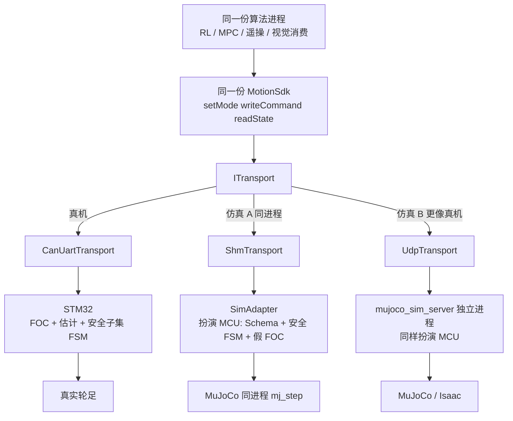
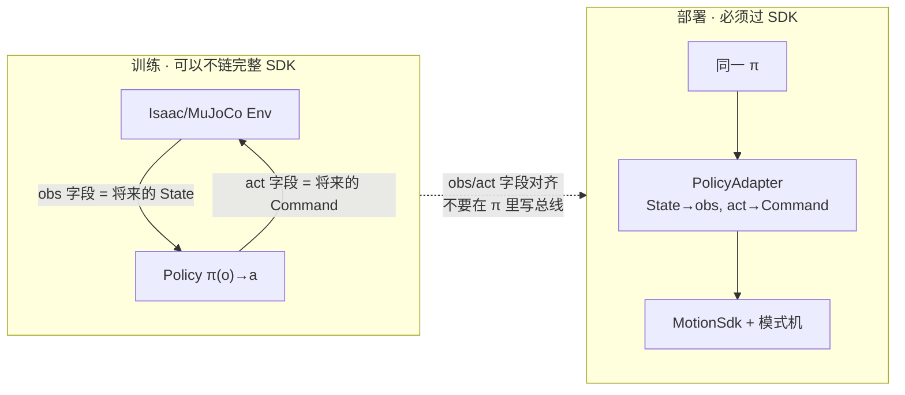
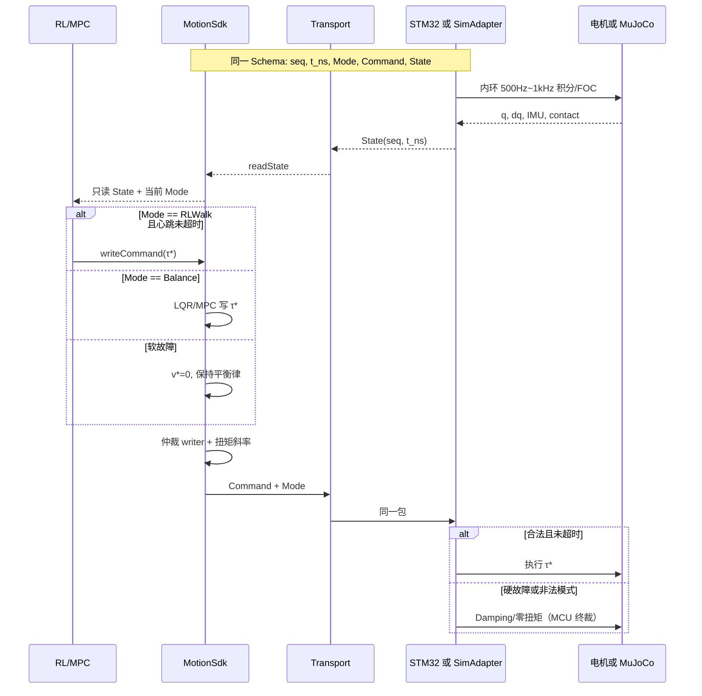

下面三张图是一套东西：**外层板卡分工 → SDK 内部 → 模式机**；仿真/真机只换 Transport 和「植物」（Plant），API 与模式机不动。

## 1. 整机：谁调用 SDK，谁执行

读图要点：视觉和 RL **不准直写扭矩**；STM32（或仿真里的 SimAdapter）是执行与硬安全的唯一终裁。ROS2 停在 SDK 外侧。

## 2. SDK 内部：四个对象 + 分层

仿真和真机的分叉只发生在最底下一层：`ITransport` 后面接的是 **STM32** 还是 **SimAdapter**。上面四层代码同一份，这才是「可迁 ARM」。

## 3. 模式机

双轮足建议把「软故障」做成 **标志位**，不要再开一个模式：断链/推理超时仍停在 `Balance` 或 `Stand`，只是 `v*=0`。硬故障才进 `Fault` 并锁存。

转移条件（面试就讲这张表）：

| 转移 | 谁申请 | 谁批准 | 扭矩怎么接 |
|---|---|---|---|
| → Stand | 操作员 / 自启动 | SDK 判倾角+接触，STM32 再确认 | 从当前 `τ` 斜率爬到站立律 |
| → Balance | SDK | 站稳时间、IMU、Session | LQR/MPC+前馈接上，bumpless |
| → RLWalk | RL 进程 | Session 活、Balance 已稳、无硬故障 | RL 建议 residual 或全量 `τ*`，有斜率 |
| RLWalk → Balance | SDK（超时）或操作员 | STM32 无条件执行回退 | 立刻改 writer，禁止双写 |
| → Fault | STM32 终裁（SDK 可上报） | MCU 看门狗也可独自进入 | 硬切 Damping/零扭矩并锁存 |
| Fault → Damping | `clearFault()` | IMU OK 且角速度受限 | 从 0 再爬，禁止自动弹回 RL |

两条硬规则：

1. **单 writer**：`Balance` 时只有 LQR/MPC 写 `τ*`；`RLWalk` 时只有策略写；切换当拍先换模式再换 writer。  
2. **双机模式机**：Orin 上 SDK 跑「完整 FSM」（给算法看）；STM32 跑「安全子集」（只认识 Damping / 闭环 / Fault）。非法模式或超时，MCU **拒绝并回退**，不听 Orin 的。

软故障（CMD/RL/视觉超时）**不换模式**，只改 Command：清速度、保持平衡，对应你车上「硬故障切电机、软故障不清平衡」。

## 4. 仿真 ↔ 真机：同一套写法

原则：**算法进程永远只调 SDK API；仿真里用 SimAdapter 冒充 STM32 + 物理世界。**  
不要在 RL 里写 `if (sim) mj_step(); else can_send();`。

三种后端对比：

| | 真机 | 仿真 A：共享内存 | 仿真 B：UDP 假 MCU |
|---|---|---|---|
| 算法看到的 API | 相同 | 相同 | 相同 |
| Schema | 相同头文件 | 相同 | 相同 |
| 模式机 | SDK + STM32 | SDK + SimAdapter | SDK + sim_server |
| 延迟/丢包 | CAN 真实 | 几乎没有，适合训策略 | 可人为加抖动，适合测 SDK |
| 谁做 `step` | 物理世界 | Adapter 里 `mj_step` | server 里 `mj_step` |
| 用途 | 部署 | 训练、对拍 LQR/MPC | 上真机前的接入层验收 |

推荐用法：Isaac/MuJoCo **训练**用 A（快）；SDK 与模式机 **验收**用 B（像 STM32）；**上车**只换 Transport 配置，不改算法。

仿真里 SimAdapter 必须扮演 MCU 的三件事，否则「仿真能走、真机乱切模式」：

1. 按同一 Schema 回 State（含假接触、假电流、时间戳）  
2. 执行同一套安全子集 FSM（非法 `RLWalk`、心跳超时要回退）  
3. 把 `τ*` 变成关节力矩（可用一阶滤波代替真 FOC，但饱和/限幅要在）

Isaac 训练环和部署环的关系：

训练时 Env 可以直接 `step`；部署时 **PolicyAdapter** 只做向量拼装，模式申请、超时回退、bumpless 全部留给 SDK。这样「仿真里训的策略」和「Orin 上跑的策略」差在 Transport，不差在控制语义。

## 5. 一拍时序（真机 vs 仿真）

仿真 A 里 `MCU` 和 `P` 在同一进程，`T` 是共享内存，这一拍可以在几微秒内跑完，甚至允许比实时更快。仿真 B 和真机一样是「跨进程/跨板」，用来暴露 SDK 的超时与序号逻辑。

---

**写法上就记三条：**  
① 算法只依赖 SDK；② Schema + 模式机在仿真和真机各跑一份语义相同的实现（真机 MCU 为安全终裁）；③ 换后端只换 `ITransport` + Plant，不换 RL/LQR。

你现在的平衡车对应关系：ESP32 ≈ STM32 内环，WiFi+虚拟机 ≈ 调试用 UdpTransport，还缺的是 API/模式机/SimAdapter。若下一步要落到你仓库的 `shared_state` 字段上，我可以只出 Mode 枚举和 State/Command 字段表，仍然不写工程代码。